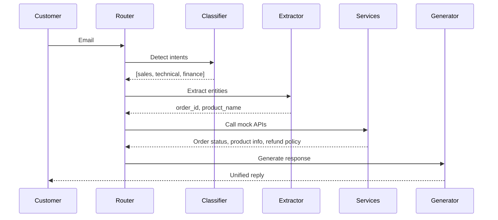

# Intelligent Email Support Orchestrator

An AI-powered system that analyzes multi-intent customer support emails, routes requests to appropriate departments, fetches data from mock APIs, and generates unified professional responses.


## Architecture

Email Input → Intent Router → Chain Builder → Tool Execution → Response Composer → JSON Output


## Technology Stack


| Category | Technology |
|----------|------------|
| Framework | FastAPI (async) |
| LLM | Ollama + Llama 3.2 3B (local, free) |
| Logging | Loguru |


## Design Patterns

| Pattern | Implementation |
|---------|----------------|
| **Orchestrator** | Central `WorkflowOrchestrator` controls all processing |
| **Chain of Responsibility** | Sequential task execution (extract → fetch → compose) |
| **Strategy** | Pluggable services per department (sales, technical, finance) |
| **Modular Architecture** | Isolated layers (intelligence, orchestrator, services) |


## Project Directory

```

email-ai-support-orchestrator/
│
├── src/
│   ├── config/
│   │   ├── settings.py
│   │
│   ├── orchestrator/
│   │   ├── router.py
│   │   ├── workflow.py
│   │   └── chain_builder.py
│   │
│   ├── services/
│   │   ├── order_service.py
│   │   ├── product_service.py
│   │   └── refund_service.py
│   │
│   ├── intelligence/
│   │   ├── classifier.py
│   │   ├── entity_extractor.py
│   │   └── response_generator.py
│   │
│   ├── infrastructure/
│   │   ├── llm_client.py
│   │   └── logger.py
│   │
│   ├── schemas/
│   │   ├── enums.py
│   │   ├── request.py
│   │   ├── response.py
│   │   └── workflow.py
│   │
│   ├── mock_data/
│   │   └── mock_apis.py
│   │
│   └── main.py
│
├── tests/
│
├── prompts/
│   ├── simple_email.txt
│   └── complex_email.txt
│
│
├── .env
├── .gitignore
├── pyproject.toml
├── requirements.txt
├── Makefile
├── README.md
└── LICENSE

```

## Quick Start

### Prerequisites

- Python 3.11+
- Ollama installed
- 8GB+ RAM (4GB free for model)


### Installation
```bash
git clone https://github.com/AmirMohammad-Sharbati/email-ai-support-orchestrator.git
cd email-ai-support-orchestrator

# Create virtual environment
python -m venv venv
source venv/bin/activate  # Linux/Mac
# venv\Scripts\activate   # Windows

pip install -r requirements.txt
```


### Running the System

#### Terminal 1 – Start Ollama

```bash
ollama serve
```

#### Terminal 2 – Start API

```bash
ollama list  # Should show llama3.2:3b

cd email-ai-support-orchestrator
source venv/bin/activate
export PYTHONPATH=$(pwd)/src
uvicorn src.main:app --host 0.0.0.0 --port 8000
```


### API Usage

#### Health Check

```bash
curl http://localhost:8000/health
```

#### Process Email

```bash
curl -X POST http://localhost:8000/process \
  -H "Content-Type: application/json" \
  -d '{"email_text": "My order #1234 is late and my speaker is broken. Can I get a refund?"}'
```


## Processing Flow


