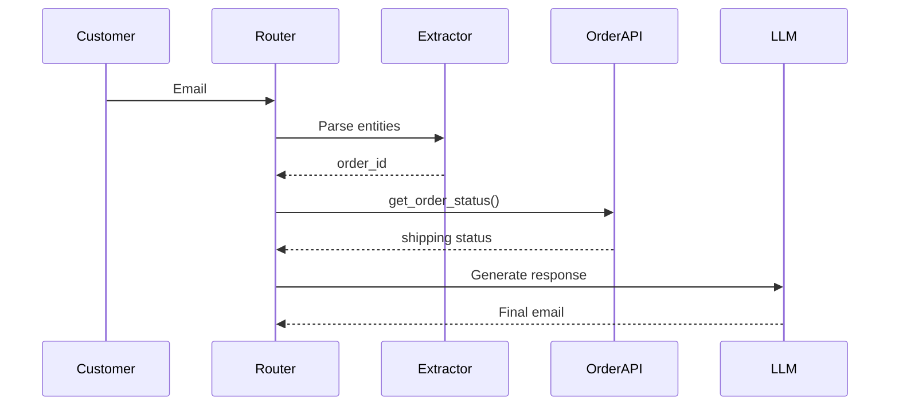

# Intelligent Email Support Orchestrator

## Architecture

Email Input → AI Router → Intent Detection → Chain Builder → Tool Execution → Response Composer → JSON Output


## Technology Stack
- **FastAPI**: Async web framework
- **Groq (LLaMA 3 70B)**: 70B parameter LLM for routing & composition
- **Docker**: Containerization
- **Pydantic**: Type-safe data validation

## Quick Start

### Prerequisites
- Python 3.11+
- Groq API key (free)

### Installation
```bash
git clone <repo>
cd email-orchestrator
python -m venv venv
source venv/bin/activate
pip install -r requirements.txt
echo "GROQ_API_KEY=your_key" > .env
```

### Run
```bash

# Development
uvicorn src.main:app --reload

# Production with Docker
docker-compose up --build
```


### API Usage
```bash

curl -X POST http://localhost:8000/process-email \
  -H "Content-Type: application/json" \
  -d '{"email_text": "My order #1234 is late and my speaker is broken. Can I refund?"}'
```

### Design Patterns
- Router Pattern: AI-based intent routing
- Chain of Responsibility: Sequential task execution
- Strategy Pattern: Pluggable tools per department
- Orchestrator Pattern: Centralized workflow control

### Testing
```bash
pytest tests/ -v --cov=src
```


---

## Running Your Perfect Project

```bash
# 1. Create project
mkdir email-orchestrator && cd email-orchestrator

# 2. Create all files above (copy-paste)

# 3. Install
python -m venv venv
source venv/bin/activate  # or venv\Scripts\activate on Windows
pip install -r requirements.txt

# 4. Add API key to .env
echo "GROQ_API_KEY=your_groq_key" > .env

# 5. Run
uvicorn src.main:app --reload

# 6. Test in another terminal
curl -X POST http://localhost:8000/process-email \
  -H "Content-Type: application/json" \
  -d '{"email_text": "Order ORD-1234 not arrived, speaker wont connect, need refund"}'
```

---

### Project Directory

```
email-orchestrator/
├── .env                          # API keys (never commit!)
├── .gitignore
├── README.md                     # Detailed documentation
├── requirements.txt
├── docker-compose.yml            # Optional: shows DevOps skill
├── Dockerfile                    # Containerization
├── config/
│   ├── __init__.py
│   └── settings.py               # Configuration management
├── src/
│   ├── __init__.py
│   ├── main.py                   # FastAPI entry point
│   ├── orchestrator/
│   │   ├── __init__.py
│   │   ├── router.py             # AI Router (LLM decides steps)
│   │   └── chain_builder.py      # Builds execution chain
│   ├── agents/
│   │   ├── __init__.py
│   │   ├── intent_agent.py       # Extracts intents via LLM
│   │   ├── extractor_agent.py    # Extracts entities (order IDs, products)
│   │   └── composer_agent.py     # Generates final email
│   ├── tools/
│   │   ├── __init__.py
│   │   ├── order_tool.py
│   │   ├── product_tool.py
│   │   └── refund_tool.py
│   └── models/
│       ├── __init__.py
│       └── schemas.py            # Pydantic models
├── tests/
│   ├── __init__.py
│   ├── test_orchestrator.py
│   └── test_agents.py
└── examples/
    └── sample_emails.json        # Test cases
```


1. Receive email
        ↓
2. Router analyzes email
        ↓
3. Detect intents
        ↓
4. Extract order/product info
        ↓
5. Create task chain
        ↓
6. Call required APIs
        ↓
7. Gather outputs
        ↓
8. Generate unified response
        ↓
9. Produce JSON


----

Design patterns you should mention in README

Mention these for bonus points:

1. Orchestrator Pattern

Router controls workflow.

2. Chain of Responsibility

Tasks processed sequentially.

3. Modular Architecture

Each department isolated.

Easy maintenance.

4. Dependency Separation

Mock APIs separated from business logic.

Very professional answer.


----

