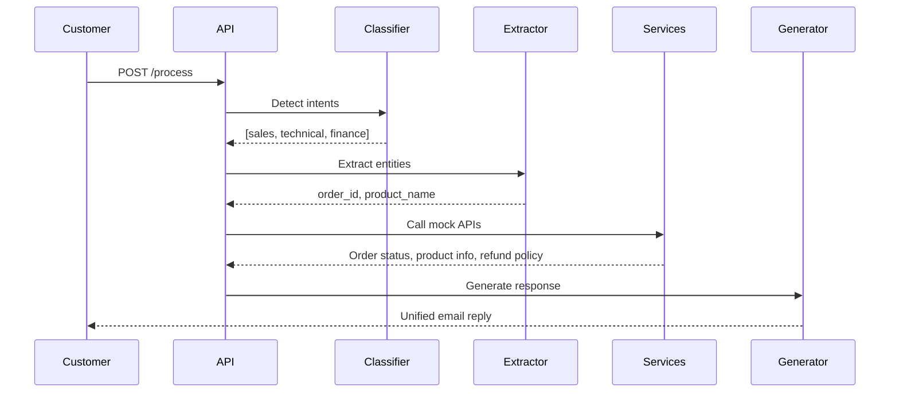
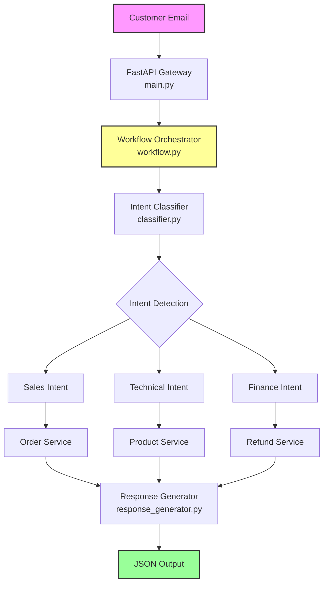

# Intelligent Email Support Orchestrator


An AI-powered system that analyzes multi-intent customer support emails, routes requests to appropriate departments, fetches data from mock APIs, and generates unified professional responses.


## Architecture

Email Input → Intent Router → Chain Builder → Tool Execution → Response Composer → JSON Output


## Technology Stack


| Category | Technology |
|----------|------------|
| Framework | FastAPI (async) |
| LLM | Ollama + Llama 3.2 3B (local, free) |
| HTTP Client | httpx |
| Validation | Pydantic + Pydantic Settings |
| Logging | Loguru |
| Testing | Pytest |


## Design Patterns

| Pattern | Implementation |
|---------|----------------|
| **Orchestrator** | Central `WorkflowOrchestrator` controls all processing |
| **Chain of Responsibility** | Sequential task execution (extract → fetch → compose) |
| **Strategy** | Pluggable services per department (sales, technical, finance) |
| **Modular Architecture** | Isolated layers (intelligence, orchestrator, services) |


## Project Directory

```

email-ai-support-orchestrator/
│
├── src/
│   ├── config/
│   │   └── settings.py        # Environment configuration
│   │
│   ├── orchestrator/
│   │   ├── router.py          # Intent routing
│   │   ├── workflow.py        # Main orchestration
│   │   └── chain_builder.py   # Task execution chain
│   │
│   ├── services/
│   │   ├── order_service.py   # Order status API
│   │   ├── product_service.py # Product info API
│   │   └── refund_service.py  # Refund policy API
│   │
│   ├── intelligence/
│   │   ├── classifier.py         # Intent detection
│   │   ├── entity_extractor.py   # Entity extraction
│   │   └── response_generator.py # Email composition
│   │
│   ├── infrastructure/
│   │   ├── llm_client.py      # Ollama wrapper
│   │   └── logger.py          # Logging setup
│   │
│   ├── schemas/
│   │   ├── enums.py           # Department, StepType enums
│   │   ├── request.py         # API request models
│   │   ├── response.py        # API response models
│   │   └── workflow.py        # Intent model
│   │
│   ├── mock_data/
│   │   └── mock_apis.py       # Mock department APIs
│   │
│   └── main.py                # FastAPI entry point
│
├── tests/                    
│
├── prompts/
│   ├── simple_email.txt
│   └── complex_email.txt
│
│
├── .env
├── .gitignore
├── project_description.pdf
├── pyproject.toml
├── requirements.txt
├── Makefile
├── README.md
└── LICENSE

```

## Quick Start

### Prerequisites

- Python 3.11+
- Ollama installed
- 8GB+ RAM (4GB free for model)


### Installation
```bash
git clone https://github.com/AmirMohammad-Sharbati/email-ai-support-orchestrator.git
cd email-ai-support-orchestrator

# Create virtual environment
python -m venv venv
source venv/bin/activate  # Linux/Mac
# venv\Scripts\activate   # Windows

pip install -r requirements.txt
```


### Running the System

#### Terminal 1 – Start Ollama

```bash
ollama serve
```

#### Terminal 2 – Start API

```bash
ollama list  # Should show llama3.2:3b

cd email-ai-support-orchestrator
source venv/bin/activate
export PYTHONPATH=$(pwd)/src
uvicorn src.main:app --host 0.0.0.0 --port 8000
```

## Development Commands

With Makefile, starting program is easier...

```bash
make install  # Install dependencies
make run      # Start the API server
make test     # Run tests
make clean    # Remove cache files
```

## API Usage

### Health Check

```bash
curl http://localhost:8000/health
```

#### Response:

```
{
  "status": "healthy",
  "model": "llama3.2:3b",
  "ollama_endpoint": "http://localhost:11434",
  "ollama_connection": "connected"
}
```

### Process Email

```bash
curl -X POST http://localhost:8000/process \
  -H "Content-Type: application/json" \
  -d '{"email_text": "My order #1234 is late and my speaker is broken. Can I get a refund?"}'
```

#### Response Structure

| Field	| Description |
|---|---|
| `original_text`	| Original customer email |
| `processing_steps`	| Detailed trace of all actions taken |
| `final_response`	| Generated professional email reply |
| `metadata`	| Processing statistics (intent count, model used, departments involved) |


## Environment Configuration
Create .env file:
```
# Ollama Configuration
OLLAMA_BASE_URL=http://localhost:11434
OLLAMA_MODEL=llama3.2:3b
OLLAMA_TIMEOUT=300
OLLAMA_TEMPERATURE=0.1
OLLAMA_RETRIES=3

# Application Configuration
ENVIRONMENT=development
LOG_LEVEL=DEBUG
MAX_EMAIL_LENGTH=10000
MAX_EMAIL_PREVIEW=100
DEFAULT_CONFIDENCE=0.7
```

## Performance

| Environment	| Hardware	| Time per Email |
| Local (CPU)	| Intel Core i7	| ~15-25 minutes |
| Kaggle (GPU)	| Tesla P100	| ~10-20 seconds |

*First request loads model into memory. Subsequent requests are faster.*


## Architecture

### High-Level Overview

The system follows a **pipeline architecture** with four main layers:

| Layer | Components | Responsibility |
|-------|------------|----------------|
| **API Gateway** | `main.py` | Receive emails, validate input |
| **Orchestration** | `orchestrator/workflow.py`, `orchestrator/router.py` | Control flow, detect intents |
| **Execution** | `orchestrator/chain_builder.py`, `services/` | Extract entities, call APIs |
| **Intelligence** | `intelligence/classifier.py`, `intelligence/entity_extractor.py` | LLM operations |
| **Generation** | `intelligence/response_generator.py` | Compose final email |


### Sequence Flow




### Data Flow

- Input: Raw email text
- Intent Detection: LLM identifies departments
- Entity Extraction: Regex + LLM extracts order_id, product_name
- API Calls: Mock services return data
- Response Generation: LLM composes professional email
- Output: JSON with original text, steps, and response


### Component Diagram




## Testing

```
pytest tests/ -v
```

## License

MIT


## Author

AmirMohammad Sharbati